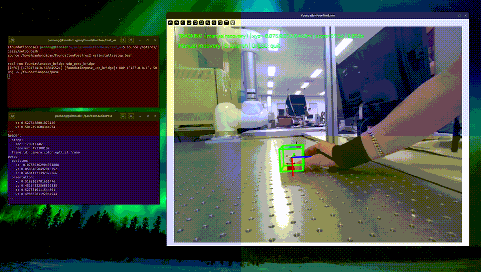
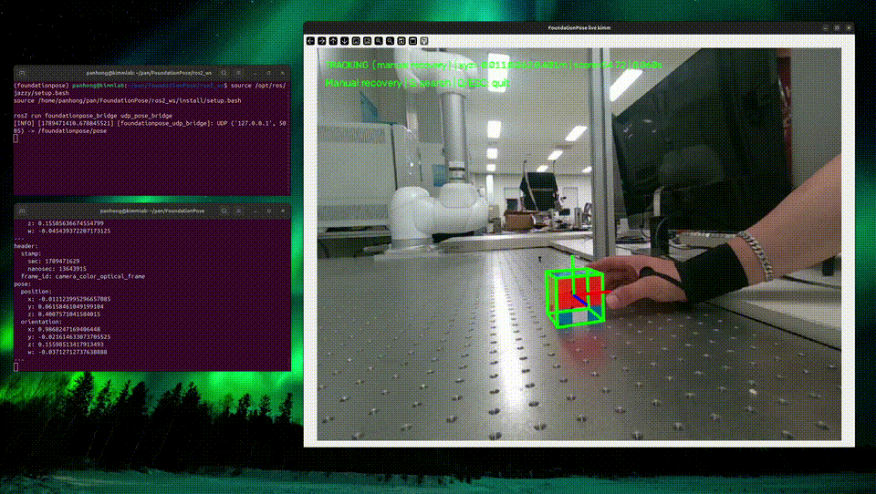
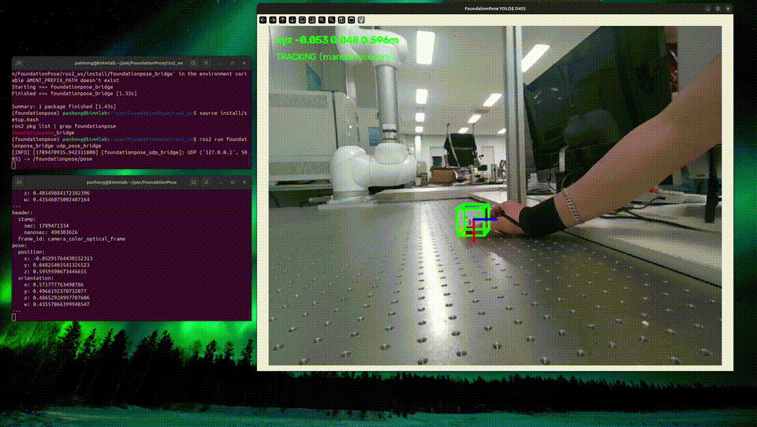
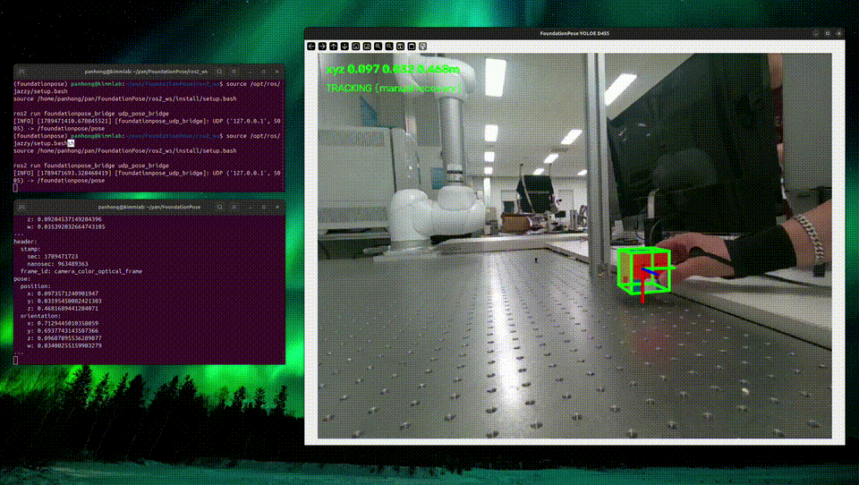

# FoundationPose 실시간 사용 가이드

| | 성공 | 실패 |
|---|---|---|
| Grounding DINO + SAM2 |  |  |
| YOLOE |  |  |

이 저장소는 FoundationPose를 학습하지 않고, 준비된 모델과 CAD를 이용해 D455 RGB-D 카메라에서 6D pose를 추정하고 ROS2로 전달하기 위한 실행 코드입니다.

## 1. 환경 준비

```bash
cd /home/pan/pan/6D_pose
conda env create -f environment.yml
conda activate foundationpose
bash build_all.sh
pip install -U pyrealsense2 ultralytics
```

이미 `foundationpose` 환경이 있으면 환경 생성은 생략합니다. D455 연결 확인:

```bash
python -c "import pyrealsense2 as rs; print(rs.context().query_devices().size())"
```

`1` 이상이면 카메라가 인식된 것입니다.

## 2. ROS2 bridge 빌드

```bash
cd /home/pan/pan/6D_pose/ros2_ws
source /opt/ros/jazzy/setup.bash
colcon build --packages-select foundationpose_bridge
```

## 3. ROS2 pose 확인

터미널 1:

```bash
source /opt/ros/jazzy/setup.bash
source /home/pan/pan/6D_pose/ros2_ws/install/setup.bash
ros2 run foundationpose_bridge udp_pose_bridge
```

터미널 2:

```bash
source /opt/ros/jazzy/setup.bash
source /home/pan/pan/6D_pose/ros2_ws/install/setup.bash
ros2 topic echo /foundationpose/pose
```

## 4. D455 + DINO + SAM2 + FoundationPose

터미널 3:

```bash
conda activate foundationpose
cd /home/pan/pan/6D_pose
python real_time_project/main.py --detector dino \
  --mesh_file /home/pan/pan/6D_pose/demo_data/077_rubiks_cube/google_16k/textured_57mm.obj \
  --mesh_scale 1.0 \
  --prompt "rubik's cube" \
  --validation_interval 0
```

처음에는 DINO가 bbox를 찾고 SAM2가 mask를 생성합니다. 이후에는 FoundationPose와 Cutie/Kalman이 추적합니다. `s`는 수동 재탐색, `q` 또는 `ESC`는 종료입니다. 자동 재탐색은 `--auto_recovery`를 추가합니다.

## 5. D455 + YOLOE + FoundationPose

YOLOE-seg는 text prompt로 bbox와 mask를 한 번에 생성합니다. 실행 파일은 `real_time_project/main.py`이고 `--detector yoloe`(기본) 또는 `--detector dino`로 검출기를 고릅니다.

```bash
conda activate foundationpose
cd ~/pan/6D_pose
python real_time_project/main.py --detector yoloe \
  --mesh_file demo_data/077_rubiks_cube/google_16k/textured_57mm.obj \
  --yoloe_checkpoint yoloe-v8l-seg.pt --prompt "toy cube"
```

`s`는 수동 재탐색, `q` 또는 `ESC`는 종료입니다. YOLOE text encoder(`mobileclip_blt.ts`)는 실행 폴더에서 찾으므로 `6D_pose` 루트에서 실행합니다.

### 동작 흐름 (`real_time_utils.py`)

1. `RecoveryTracker`가 YOLOE mask를 받아 `PoseTracker`가 FoundationPose `register()`로 초기 pose를 잡습니다.
2. 이후 프레임마다 Cutie가 2D bbox를 주고 Kalman filter가 위치를 보정한 뒤 `track_one()`으로 pose를 갱신합니다.
3. 자동 재탐지(기본 켜짐)는 아래 신호가 `--loss_patience`(5)프레임 연속이면 lost로 처리하고 YOLOE로 다시 등록합니다. 의심 상태의 pose는 화면에는 그리지만 UDP로는 보내지 않습니다.
   - score가 최근 평균의 `--drift_score_ratio`(0.3) 아래로 하락
   - pose 중심이 화면 밖이거나 주변 depth와 어긋남
   - `--validation_interval`(0.5초)마다 YOLOE bbox와 pose 중심이 어긋나거나, 검출을 5번 연속 놓침
4. 프레임 간격이 1초를 넘어도 재탐지합니다. 수동 재탐지는 `--no-auto_recovery`입니다.

### 주요 옵션

| 옵션 | 기본값 | 설명 |
|---|---|---|
| `--register_iter` | 10 | 초기 등록 iteration (FoundationPose++ 기본) |
| `--track_iter` | 3 | tracking iteration (원본 5, 낮추면 빠르고 덜 정확) |
| `--score_interval` | 3 | drift 검사용 scorer를 N프레임에 1회 실행 |
| `--relock_iterations` / `--roi_patience` | 0 / 0 | 0이면 꺼짐. 속도용 단축 경로(prior 방향 relock, ROI crop) |
| `--conf` | 0.15 | YOLOE confidence |

30프레임마다 `[TIMING] fps=… read=…ms process=…ms draw+show=…ms`가 출력됩니다. lost 원인은 `[LOST]`, `[SUSPECT]` 로그에 표시됩니다.

## 6. 모델과 폴더 구조

Rubik’s Cube CAD는 `demo_data/077_rubiks_cube/google_16k/textured_57mm.obj`이며 `--mesh_scale 1.0`을 사용합니다. FoundationPose weights는 `weights/` 아래에 준비합니다. 모델 weights, Hugging Face cache, debug 결과는 Git에 올리지 않습니다.

```text
FoundationPose/
├── real_time_project/
│   ├── main.py                          # 실행 (--detector yoloe | dino)
│   ├── real_time_utils.py               # D455 입력, PoseTracker, RecoveryTracker
│   └── detectors.py                     # YOLOEPipeline, GroundingDINOSAM2Pipeline
├── yoloe-v8l-seg.pt                     # 기본 YOLOE checkpoint (Git 제외)
├── mobileclip_blt.ts                    # YOLOE text encoder (Git 제외)
├── calibration/                         # 실기 M1013 + D455: hand-eye, 계획, 감독형 이동 (7장 참고)
├── collab/                              # 진행 기록 (CONTEXT, DECISIONS, LOG)
├── demo_data/
├── weights/
├── estimater.py
├── pose_sender_kimm.py
└── environment.yml
```

ROS2 bridge:

```text
/home/pan/pan/6D_pose/ros2_ws/src/foundationpose_bridge/
```

발행 토픽은 `/foundationpose/pose`이며 타입은 `geometry_msgs/msg/PoseStamped`입니다. Pose는 카메라 좌표계 기준입니다.

## 7. 실기 로봇 연동 (Doosan M1013 + 고정 D455) — 현재 진행 상황

고정 D455가 큐브를 보고 FoundationPose로 `T_cam_object`를 구하면, hand-eye 결과 `T_base_cam`으로 로봇 base 좌표로 바꾸고, IK와 프레임 충돌 검사를 거쳐 관절 경유점 표를 만들고, 사람이 점마다 승인하며 최저속으로 이동합니다. 자세한 구성과 안전 규칙은 [`calibration/README.md`](calibration/README.md)에 있습니다.

```text
T_base_object = T_base_cam @ T_cam_object      # 단위 m, 카메라 OpenCV 축
main.py (YOLOE+FoundationPose) --UDP 5005--> real_pose_dryrun.py --경유점 표--> ros2_pendant_mover.py (사람이 go)
```

### 지금까지 확인된 것 (2026-10-01, 실기)

| 항목 | 결과 |
|---|---|
| 로봇 연결 | ROS2 bringup 정상, 현재 관절/flange 읽기 가능 (펜던트 값과 일치) |
| 기구학 모델 | 관절 0°에서 모델 flange (0.14, 34.8, 1452.5) mm vs 실제 (0.02, 34.5, 1452.5) mm |
| hand-eye (flange ArUco 100 mm, 25 자세) | 맞춤 오차 평균 5.3 mm / 1.3°, leave-one-out 평균 5.9 mm / 1.4° |
| 카메라 위치 줄자 대조 | 렌즈 높이 11.5 cm (계산 9.2 cm, 보정 후 11.5 cm), base~렌즈 수평 156 cm (계산 156.4 cm) |
| 큐브 위치 vs flange를 큐브 위에 눈으로 맞춘 값 | 수평 약 1~2 cm 차이 (눈 맞춤 오차 포함, 정밀 대조는 미완) |
| 접근 이동 시험 | 3구간 점마다 `go`, 2 deg/s, 도착 오차 ≤ 0.01°, flange가 계획 목표와 0.3 mm 일치, 복귀 성공 |
| 프레임 충돌 | 기둥 4개 실측(x 0.85/1.65 m, y ±0.56 m) 반영, 경유점 직선 구간 최소 거리 120 mm (기준 100 mm) |

### 아직 안 된 것 / 주의

- 큐브 위치의 실제 정확도는 1~2 cm 수준으로만 확인됨(포인터 등으로 mm 대조 필요). 파지에는 부족합니다.
- 마커 크기가 약 0.977배로 두 번 일관되게 추정됨. 카메라 높이는 줄자 값으로 보정(`T_base_cam_zfix.json`, 기본값). 원인(마커 인쇄/내부 파라미터) 미확정.
- **카메라는 캘리브레이션 뒤 절대 움직이면 안 됨**(움직이면 약 14°/16 cm 오차가 났음). 움직였으면 재캘리브레이션.
- 프로파일 굵기, 테이블 가장자리 위치는 가정. 그리퍼 TCP/개폭 미정, 하강·파지·후퇴 동작 미구현.
- 실제 D455 depth(반사 테이블)에서 FoundationPose 정확도는 별도 검증 필요. 640x480 입력 사용(1280x720은 메모리 부족).

## 8. 검증 명령어

`~/pan/6D_pose`에서 실행합니다. 1~2번은 카메라·로봇 없이 됩니다.

```bash
# 1) 오프라인 시험 12개 (기구학·IK·hand-eye 해·프레임 배치·계획·이동 거부 규칙·궤적)
cd calibration && conda run -n foundationpose python -m unittest test_core      # 기대: Ran 12 tests ... OK
cd ..

# 2) 스크립트 구문/도움말
for f in auto_handeye_capture check_marker predict_base_pose ik_reach_check verify_handeye_marker real_pose_dryrun analyze_handeye_samples; do
  conda run -n foundationpose python calibration/$f.py --help >/dev/null && echo "ok $f"; done

# 3) 카메라 / 로봇 연결 (D455 연결, 로봇 bringup 실행 상태)
conda run -n foundationpose python -c "import pyrealsense2 as rs; print(rs.context().query_devices().size())"   # 1 이상
ping -c 3 192.168.127.100                                                              # 0% loss (없으면: sudo ip addr add 192.168.127.5/24 dev enp5s0)
source /opt/ros/jazzy/setup.bash && source ~/pan/doosan_ws/install/setup.bash          # (conda deactivate 후)
ros2 service call /dsr01/dsr_controller2/aux_control/get_current_tool_flange_posx dsr_msgs2/srv/GetCurrentToolFlangePosx "{ref: 0}"   # 읽기 전용, 펜던트 값과 비교

# 4) hand-eye (카메라 고정 후, 로봇은 사람이 움직임, ArUco 변 길이 실측값 m)
./calibration/run_real_handeye_auto.sh --marker_size 0.10      # 기대: fit/leave-one-out 평균 ≲ 6 mm, 짝 검사 통과
conda run -n foundationpose python calibration/verify_handeye_marker.py --posx "x y z a b c"   # 마커가 카메라를 향한 자세에서

# 5) 인식 + base 좌표 예측 (큐브 위에 flange를 둔 뒤 비교)
python real_time_project/main.py --serial 338122300585 --width 640 --height 480
python calibration/predict_base_pose.py --compare "x y z a b c" --offset 0 0 <flange가 큐브 중심 위로 mm>

# 6) 이동 계획 (로봇 안 움직임) 과 이동 스크립트 검사 (--execute 없음 = 검사만)
python calibration/real_pose_dryrun.py --once
python3 calibration/ros2_pendant_mover.py --plan calibration/data/real_dryrun/<시간>/plan_001.json --leg approach

# 7) 실제 이동 (사람이 실행): 펜던트에서 제어권 이전, 비상정지 대기, 가장 느린 속도, 점마다 go
python3 calibration/ros2_pendant_mover.py --plan <plan.json> --leg approach --execute
python3 calibration/ros2_pendant_mover.py --plan <plan.json> --leg return   --execute
```

규칙: 실기 이동은 7번 스크립트만 사용하고 항상 최저속(기본 2 deg/s, 한도 5 deg/s)입니다. 계획이 거부되었거나(`REFUSED`) 30분이 지났거나 현재 관절이 출발점과 3° 이상 다르면 이동하지 않습니다. 결과와 결정은 `collab/DECISIONS.md`, `collab/LOG.md`에 기록합니다.
